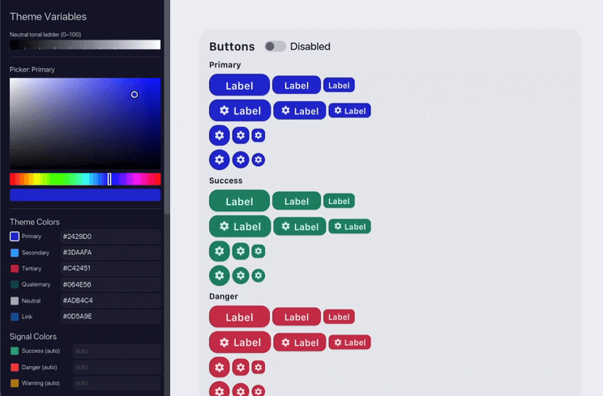

# ICSS

A CSS-like theme engine, generative design system, and widget library for the
[iced](https://github.com/iced-rs/iced) GUI framework. Targets iced 0.14.



*The showcase app: a live gallery of every widget and an interactive theme
editor, driven by the engine.*

ICSS lets you style a Rust desktop app the way you'd style a web app: write a
`.icss` file with classes, variables, and pseudo-states, then attach class
lists to your widgets.

```rust
let theme = icss::Theme::load(include_str!("theme.icss"))?;
button("Connect").style(theme.button(&["button", "primary"]));
```

> **See it rendered:** [`docs/preview.html`](docs/preview.html) is a
> single-file visual mockup. Open it in any browser to see the widgets
> styled by ICSS alongside the Rust + `.icss` source that produces them.


## Why

iced's native styling API is closure-based: every widget takes a
`Fn(&Theme, Status) -> Style`. That works, but in a real app you end up:

- repeating the same style closures across files
- hardcoding colours and radii inline
- forking the closure for every variant (primary/danger/small/disabled…)

ICSS replaces that with the model people already know from the web (class
lists, variables, pseudo-states) without bringing in a browser. Themes are
plain text files that can be hot-reloaded.

## Layout

This is a Cargo workspace with one library crate and one showcase app.

| Path | Crate | Description |
|------|-------|-------------|
| `crates/icss` | `icss` | The library, three modules below |
| `apps/showcase` | `icss-showcase` | Live component gallery + interactive theme editor |

The `icss` crate has three modules:

- **`icss::theme`**: parses `.icss` and resolves widget styles for iced.
- **`icss::engine`**: generative design system. Produces a complete `.icss`
  theme from a handful of base variables (OKLCH tonal palettes, dimensional
  tokens, semantic light/dark mapping).
- **`icss::widgets`**: theme-aware iced widgets that don't ship in core:
  `DataTable`, `TileGrid`, `ButtonGroup`, `ControlGroup`, `IconInput`,
  `StickySection`, and a tabbed `TabBar`.

## The theme file

`.icss` is a CSS subset. The grammar is tiny: `:root { --vars }`, class
selectors with conjunction, five pseudo-classes (`:hover`, `:active`,
`:focus`, `:disabled`, `:checked`), and standard properties
(`background-color`, `color`, `border-radius`, `padding`, `box-shadow`,
`font-size`, `font-weight`).

```css
:root {
    --primary:   #0f3460;
    --success:   #16c79a;
    --danger:    #e94560;
    --surface:   #1a1a2e;
    --surface-raised: #25254a;
    --text:      #eaeaea;
    --text-soft: #888888;
    --border:    #ffffff20;
}

.button {
    color: #ffffff;
    border-radius: 8px;
    padding: 8px 16px;
}

.primary           { background-color: var(--primary); }
.primary:hover     { background-color: #1a4a80; }
.primary:disabled  { background-color: #333; color: rgba(255,255,255,0.4); }

.button.primary    { box-shadow: 0 2px 8px rgba(0,0,0,0.25); }

.small             { border-radius: 6px; padding: 4px 10px; }
.pill              { border-radius: 9999px; }
```

Classes compose conjunctively, just like HTML: `["button", "primary", "small"]`
activates rules from `.button`, `.primary`, `.small`, `.button.primary`, and
so on.

## The Rust side

Load the theme once, then attach class lists to widgets.

```rust
use iced::widget::{button, text, text_input, checkbox, column, row};

let t = icss::Theme::load(include_str!("theme.icss"))?;

// Buttons
button(text("Save")).style(t.button(&["button", "primary"]));
button(text("Cancel")).style(t.button(&["button", "default"]));
button(text("Delete")).style(t.button(&["button", "danger", "small"]));

// Text input
text_input("Search…", &query)
    .style(t.text_input(&["input", "sz-md"]))
    .on_input(Msg::Query);

// Checkbox
checkbox(accepted)
    .label("Accept terms")
    .on_toggle(Msg::Accept)
    .style(t.checkbox(&["checkbox", "sz-md"]));

// Typography
t.text("Settings", &["title-medium"]);
t.text("Configure your account preferences", &["body-small", "text-soft"]);

// Layout
t.column(&["stack"])
    .push(t.text("Profile", &["title-small"]))
    .push(input)
    .push(buttons);
```

### Sizing tokens

For widgets where font size, padding, and gap need to agree (text input, pick
list, checkbox label), use the size tokens:

```rust
let md = t.sizing(&["sz-md"]);    // → font_size, pad_v, pad_h, gap, min_width
let sm = t.sizing(&["sz-sm"]);
let xs = t.sizing(&["sz-xs"]);

text_input("Email", &email)
    .size(md.font_size)
    .padding(md.padding())
    .style(t.text_input(&["input", "sz-md"]));
```

This keeps a 12px input from being paired with 16px text inside it.

## A complete mini-form

```rust
fn view(state: &State) -> Element<Msg> {
    let t = &state.theme;
    let md = t.sizing(&["sz-md"]);

    t.frame(
        t.column(&["subsection"])
            .push(t.text("Sign in", &["title-medium"]))
            .push(
                text_input("Email", &state.email)
                    .size(md.font_size).padding(md.padding())
                    .on_input(Msg::Email)
                    .style(t.text_input(&["input", "sz-md"])),
            )
            .push(
                text_input("Password", &state.password)
                    .size(md.font_size).padding(md.padding())
                    .secure(true)
                    .on_input(Msg::Password)
                    .style(t.text_input(&["input", "sz-md"])),
            )
            .push(
                checkbox(state.remember).label("Remember me")
                    .size(md.font_size).text_size(md.font_size).spacing(md.gap)
                    .on_toggle(Msg::Remember)
                    .style(t.checkbox(&["checkbox", "sz-md"])),
            )
            .push(
                t.row(&["row"])
                    .push(button(text("Cancel")).style(t.button(&["button", "default"])))
                    .push(button(text("Sign in")).style(t.button(&["button", "primary"]))),
            ),
        &["section", "section-body"],
    )
    .into()
}
```

No style closures and no inline magic numbers left in the view code.

## Component catalog (excerpt)

| Widget | Helper | Common classes |
|--------|--------|----------------|
| Button | `t.button(&[…])` | `button`, `primary`, `success`, `danger`, `warning`, `default`, `ghost`, `small`, `tiny`, `pill`, `round` |
| Container | `t.container(&[…])` | `page`, `section`, `section-body`, `page-body` |
| Text input | `t.text_input(&[…])` | `input`, `sz-xs`/`sz-sm`/`sz-md`, `error` |
| Checkbox | `t.checkbox(&[…])` | `checkbox`, `sz-xs`/`sz-sm`/`sz-md` |
| Toggler | `t.toggler(&[…])` | `toggle` |
| Radio | `t.radio(&[…])` | `radio` |
| Slider | `t.slider(&[…])` | `slider` |
| Progress | `t.progress_bar(&[…])` | `progress`, `success`, `danger`, `warning` |
| Pick list | `t.pick_list(&[…])` + `t.menu(&[…])` | `select` / `select-menu` + `sz-*` |
| Scrollable | `t.scrollable(&[…])` | `scroll` |
| Rule | `t.rule(&[…])` | `divider` |
| Text | `t.text(&[…])` | `headline-large` … `body-micro`, `caption`, `text-soft`, `text-danger`, … |
| Row / Column | `t.row(&[…])`, `t.column(&[…])` | `row`, `row-tight`, `row-loose`, `stack`, `stack-tight`, `stack-loose`, `cluster` |

The full catalog with every class, modifier, and pseudo-state is in
[`docs/COMPONENT-CATALOG.md`](docs/COMPONENT-CATALOG.md).

## Generative themes

If you don't want to hand-author a `.icss` file, `icss::engine` will produce
one from a small set of base variables:

- a brand hue + a few accents (success/danger/warning), expanded into OKLCH
  tonal palettes
- one dimensional scale (`--space-100`, `--radius-100`, `--font-100` …),
  derived from a base size and ratio
- light/dark surface mapping

```rust
let output = icss::generate(&icss::ThemeInputs::default());
let theme  = icss::Theme::load(&output.icss)?;
```

The output is a regular `.icss` string you can apply as-is or tweak further.

## Showcase app

```bash
cargo run --release -p icss-showcase
```

A live gallery of every widget plus an interactive theme editor. Change a
base colour and the whole system updates. The "Save .icss" toggle in the
tab bar controls whether edits are written to disk.

## Documentation

- [`docs/preview.html`](docs/preview.html): visual mockup of the rendered widgets (open in a browser)
- [`docs/ICSS.md`](docs/ICSS.md): `.icss` syntax specification
- [`docs/COMPONENT-CATALOG.md`](docs/COMPONENT-CATALOG.md): full class reference
- [`docs/theme-creation.md`](docs/theme-creation.md): design-system architecture
- [`docs/SHOWCASE.md`](docs/SHOWCASE.md): showcase app architecture

## Toolchain

- iced 0.14 (wgpu backend)
- Rust edition 2024, MSRV 1.85
- Pure parser and style resolver. No browser engine or JS runtime.

## License

MIT. See [LICENSE](LICENSE).
